# Analise do Projeto SAF

---

## Fluxograma (Mermaid)

```mermaid
flowchart TB
  subgraph APP["App - bootstrap"]
    MAIN["main.ts"] --> APPMOD["AppModule"]
  end

  APPMOD -->|"lazy"| TELAABERTURA["TelaAberturaModule - /login"]
  APPMOD -->|"lazy + LoginGuard"| HOMEMOD["HomeModule - /page"]
  APPMOD --> TESTE["TesteComponent - /teste"]

  subgraph TELA["Tela de Abertura"]
    TA1["Landing / Image Animate"]
    TA2["Login"]
    TA3["Cadastrar Pessoa"]
  end

  TELAABERTURA --> TA1
  TELAABERTURA --> TA2
  TELAABERTURA --> TA3

  subgraph CADASTROS["Cadastros"]
    CADPES["CadPessoas - cadcli"]
    PRODCFOP["Produto x CFOP"]
    REGPERS["Register Person"]
  end

  subgraph PROCESSAMENTO["Processamento Fiscal"]
    ENVIARQ["Enviar Arquivos"]
    PROCEFD["Processar EFD ICMS"]
    PROCSINT["Processar Sintegra"]
    IMPLAN["Importar Planilhas"]
  end

  subgraph VISUALIZACAO["Visualizacao e Resultados"]
    RESULT["Visualizar Resultados"]
    RETAG["Retaguarda Visualizar"]
    CADRC100["CadRC100 Consulta"]
    CADRC170G["CadRC170 Get"]
    COMPAR1["Comparar Celulas XLSX"]
    COMPAR2["Comparar Registros C170"]
    SAIDAS["Saidas com Entradas C170"]
    CONCLUSAO["Conclusao"]
  end

  subgraph FERRAMENTAS["Ferramentas e Config"]
    DASH["Dashboard01"]
    CONFIG["Configuracoes"]
    GOVESA["Govesa"]
    ANALISE["Analise Estrutural"]
    CADRC170S["Gerar CadRC170 SEFAZ"]
    FORM1["Formulario1"]
    TESTE2["Teste2"]
  end

  HOMEMOD --> CADPES
  HOMEMOD --> PRODCFOP
  HOMEMOD --> REGPERS
  HOMEMOD --> ENVIARQ
  HOMEMOD --> PROCEFD
  HOMEMOD --> PROCSINT
  HOMEMOD --> IMPLAN
  HOMEMOD --> RESULT
  HOMEMOD --> RETAG
  HOMEMOD --> CADRC100
  HOMEMOD --> CADRC170G
  HOMEMOD --> COMPAR1
  HOMEMOD --> COMPAR2
  HOMEMOD --> SAIDAS
  HOMEMOD --> CONCLUSAO
  HOMEMOD --> DASH
  HOMEMOD --> CONFIG
  HOMEMOD --> GOVESA
  HOMEMOD --> ANALISE
  HOMEMOD --> CADRC170S
  HOMEMOD --> FORM1
  HOMEMOD --> TESTE2

  subgraph INFRA["Infraestrutura"]
    BASEC["base-core: Guard, Session, HTTP, Directives, Pipes"]
    BASES["base-shared: Material UI, Forms, Tables, Inputs"]
    API["API Backend saf-core - REST e JWT"]
  end

  APPMOD -.->|"providers"| BASEC
  APPMOD -.->|"imports"| BASES
  HOMEMOD -.->|"HTTP calls"| API
```

---

## Resumo da arquitetura

### Stack
- **Frontend**: Angular SPA (TypeScript), Angular Material, ng-bootstrap, ng-snotify, Flex Layout
- **Backend**: API REST `saf-core` (Spring), autenticacao OAuth2/JWT
- **Locale**: `pt-BR` registrado em `AppModule`

### Entrypoint e bootstrap
`src/main.ts` inicializa o `AppModule` (`src/app/di/app.module.ts`), que registra providers centrais via factory (`ApiCreateHttpclienteService`), importa `MaterialModule`, `BaseSharedModule`, `SnotifyModule` e bootstrapa `AppComponent`.

### Roteamento
| Rota | Modulo | Protecao |
|------|--------|----------|
| `/login` | `TelaAberturaModule` (lazy) | — |
| `/page/**` | `HomeModule` (lazy) | `LoginGuard` |
| `/teste` | `TesteComponent` | — |
| `` | redirect para `/login` | — |

### Modulos principais
- **Tela de Abertura**: landing/image-animate, login, cadastro de novo usuario
- **Home / MainNav**: shell principal com sidebar e roteamento de todas as funcionalidades
  - *Cadastros*: CadPessoas, Produto x CFOP, Register Person
  - *Processamento Fiscal*: Enviar Arquivos, EFD ICMS, Sintegra, Importar Planilhas
  - *Visualizacao e Resultados*: Resultados, Retaguarda, CadRC100, CadRC170 Get, Comparadores XLSX/C170, Saidas c/ Entradas C170, Conclusao
  - *Ferramentas*: Dashboard01, Configuracoes, Govesa, Analise Estrutural, Gerar CadRC170 SEFAZ

### Infraestrutura compartilhada
- **`base-core`**: `LoginGuard`, `SessionService`, `ApiCreateHttpclienteService`, interceptors, directives (CPF/CNPJ), pipes, animacoes
- **`base-shared`**: biblioteca de componentes UI (inputs, tabelas, botoes, dialogs, selects, loading, progress), `MaterialModule`

### Comunicacao com backend
`ApiCreateHttpclienteService` e criado por factory injetando `HttpClient`, `SessionService`, `Router` e `SnotifyService`. URLs e credenciais sao definidas por ambiente em `src/environments/environment*.ts`.

